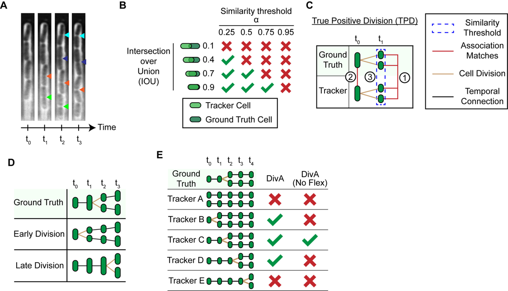

# Cell-HOTA: A Higher Order Metric for Cell Tracking Evaluation

[](https://opensource.org/licenses/MIT)
[](https://www.python.org/downloads/release/python-3100/)

Cell-HOTA is an extension of the Higher Order Tracking Accuracy (HOTA) metric, specifically designed to evaluate cell tracking algorithms with a focus on handling cell division events. Published in [PLOS Computational Biology (2025)](https://doi.org/10.1371/journal.pcbi.1013071), Cell-HOTA provides a balanced and interpretable assessment of detection, association, and division accuracy.

## Overview



*Figure from the Cell-TRACTR paper demonstrating how Cell-HOTA handles cell divisions. The metric specifically accounts for mother-daughter relationships during cell division events and allows flexible timing of divisions (early/late by one frame), ensuring robust evaluation of lineage tracking. (O'Connor and Dunlop, PLOS Computational Biology, 2025)*

Cell-HOTA builds upon the original HOTA metric developed by [Luiten et al. (2020)](https://link.springer.com/article/10.1007/s11263-020-01375-2), extending it to handle the unique challenges of cell tracking, particularly cell division events. This implementation modifies the TrackEval framework to support cell-specific tracking evaluation.

## Features

- 🔍 Comprehensive evaluation of cell tracking performance
- 🌱 Special handling of cell division events
- 🎯 Balanced assessment of detection and association accuracy
- 📊 Support for both Cell Tracking Challenge (CTC) and HOTA data formats
- 📈 Automated data format conversion
- 📋 Detailed performance reporting and visualization

## Installation

### Requirements

- Python 3.10 or later
- Basic dependencies: numpy, scipy
- Optional: matplotlib (for plotting)

Install dependencies using:

```bash
# For full functionality
pip install -r requirements.txt

# For minimal installation
pip install -r minimum_requirements.txt
```

## Usage

The main evaluation script is `run_cells_challenge.py` in the scripts directory.

### Basic Usage

```bash
python scripts/run_cells_challenge.py \
    --GT_FOLDER /path/to/gt/data \
    --TRACKERS_FOLDER /path/to/tracker/results \
    --USE_FLEX_DIV True \
    --COUNT_EDGES True
```

### Arguments

#### Required:
- `GT_FOLDER`: Path to ground truth data directory
- `TRACKERS_FOLDER`: Path to tracker results directory

#### Optional:
- `USE_FLEX_DIV`: Allow early/late divisions by one frame (Default: `True`)
- `COUNT_EDGES`: Include cells touching image edges in scoring (Default: `True`)

### Data Format Support

The code accepts data in two formats:
1. Cell Tracking Challenge (CTC) format
2. HOTA format

For CTC format, data should be in:
- Tracker results: `TRACKERS_FOLDER/../CTC`
- Ground truth: `GT_FOLDER/../../CTC/test`

For HOTA format, data should be directly in:
- `TRACKERS_FOLDER`
- `GT_FOLDER`

## Output

The evaluation produces:
- Terminal output with summary metrics
- Summary text file
- Detailed CSV results
- Performance visualization plots

All outputs are saved in the respective tracker folder.

## Custom Benchmark Evaluation

To evaluate your own tracking data:
1. Format your data following the Cell Tracking Challenge specifications
2. Use the `run_cells_challenge.py` script, which will automatically handle format conversion
3. Review the comprehensive evaluation results

## Citation

If you use Cell-HOTA in your research, please cite:

```bibtex
@article{oconnor2025cell,
    title={Cell-TRACTR: A transformer-based model for end-to-end segmentation and tracking of cells},
    author={O'Connor, Owen M and Dunlop, Mary J},
    journal={PLOS Computational Biology},
    volume={21},
    number={5},
    pages={e1013071},
    year={2025},
    publisher={Public Library of Science}
}
```

## License

Cell-HOTA is released under the [MIT License](LICENSE).

## Authors

- Owen M. O'Connor
- Mary J. Dunlop

## Acknowledgments

This work builds upon the HOTA metric by Luiten et al. and the TrackEval framework. We thank the cell tracking community for their valuable feedback and contributions.
